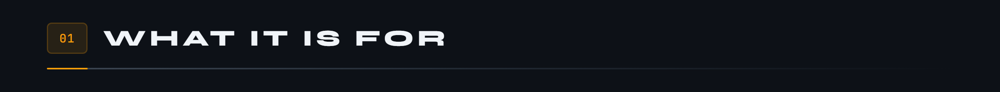
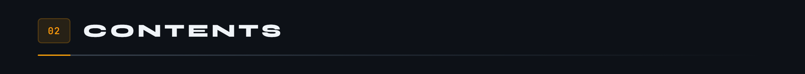
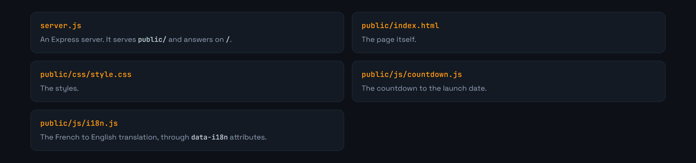
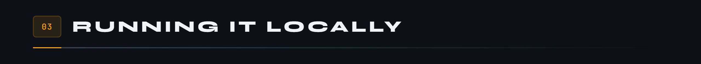
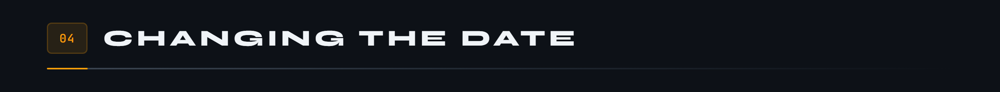
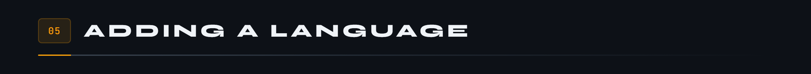

<div align="center">

<p>
  <a href="README.md"></a>
  
</p>


</div>

**The holding page for the MicroCoaster community forum: a countdown, a language switch, and nothing surplus.**



The forum is not open yet. In the meantime, this page holds the spot: it shows the time left before launch, explains what is coming, and speaks French or English depending on the visitor.

It is deliberately tiny. An Express server serving static files, no client-side framework, no build step. One `npm start` and it is live.







```bash
npm install
npm start
```

The server listens on `http://localhost:3000`, or on `PORT` if the variable is set.



The launch date is set in `public/js/countdown.js`. The startup message in `server.js` prints it too: remember to keep the two in step, otherwise the console announces one date while the page counts down to another.



`public/js/i18n.js` holds one dictionary per language code. Add an entry, reuse the same keys as the `data-i18n` attributes in the HTML, and the switch will pick it up.

A missing key breaks nothing, it simply leaves the original text where it is. That is deliberate: a half-translated holding page beats an empty one.

Written in Node.js 18 and Express 4.18. MIT licence.

---

<sub>MicroCoaster · Author: Cybertrist</sub>
