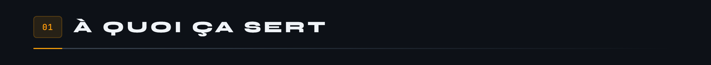
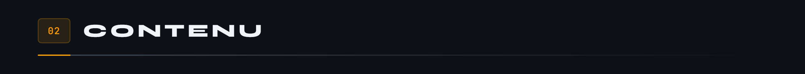
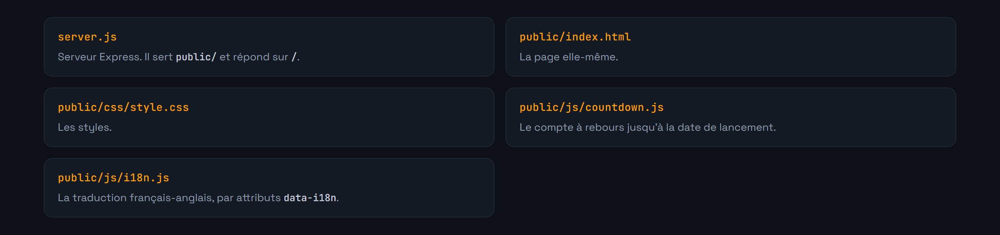
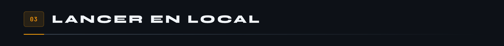
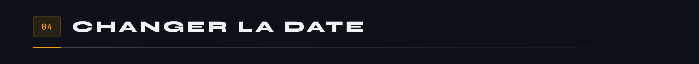
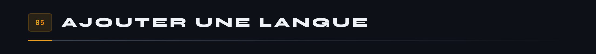

<div align="center">


</div>

**Page d'attente du forum communautaire MicroCoaster : compte à rebours, bascule de langue, et rien de superflu.**



Le forum n'est pas encore ouvert. En attendant, cette page tient la place : elle affiche le temps restant avant le lancement, explique ce qui arrive, et parle français ou anglais selon le visiteur.

C'est volontairement minuscule. Un serveur Express qui sert du statique, pas de framework côté client, pas d'étape de build. Un `npm start` et c'est en ligne.







```bash
npm install
npm start
```

Le serveur écoute sur `http://localhost:3000`, ou sur `PORT` si la variable est définie.



La date de lancement est définie dans `public/js/countdown.js`. Le message de démarrage de `server.js` l'affiche aussi : pensez à mettre les deux d'accord, sinon la console annonce une date et la page en compte une autre.



`public/js/i18n.js` contient un dictionnaire par code de langue. Ajoutez une entrée, reprenez les mêmes clés que celles portées par les attributs `data-i18n` du HTML, et la bascule la prendra en compte.

Une clé oubliée ne casse rien, elle laisse simplement le texte d'origine à sa place. C'est voulu : une page d'attente à moitié traduite vaut mieux qu'une page vide.

Écrit en Node.js 18 et Express 4.18. Licence MIT.

---

<sub>Projet MicroCoaster · voir aussi <a href="https://github.com/Cybertrist/MicroCoaster_Docs">MicroCoaster_Docs</a> et l'organisation <a href="https://github.com/Microcoaster">MicroCoaster</a>, qui héberge l'application de pilotage et les firmwares des modules.</sub>
